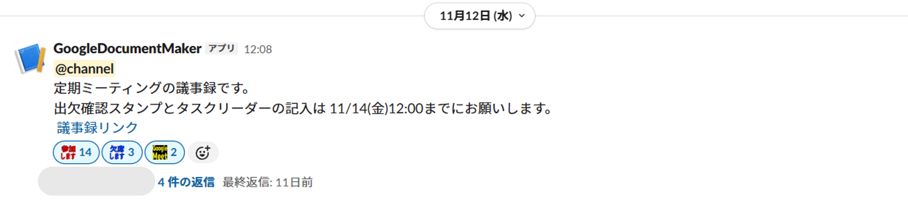

# Meeting Minutes Automation Bot

## 概要 (Overview)
アルバイト先での週末会議に向けた「議事録フォーマットの作成」と「Slackへの共有」を完全自動化するGoogle Apps Script (GAS) 製のBotです。
毎週水曜日に行う定型業務（ファイル作成・権限設定・周知）を自動化し、作成忘れの防止とチームの出欠確認の迅速化を実現しました。

## 解決した課題 (Problem Solved)
以前は以下の手順を手動で行っていました。
1. 議事録テンプレートを複製し、ファイル名を変更
2. 出欠確認欄などの日付を更新
3. Slackでメンバー全員にメンションを送り、URLを共有

しかし、多忙時にこの作業を失念してしまい、メンバーの出欠入力が遅れることがありました。このBotにより、**毎週水曜日に自動で**次回の会議の準備が完了する仕組みを構築しました。

## 機能 (Features)
* **ドキュメント自動生成**:
    * テンプレートとなるGoogleドキュメントを自動コピー。
    * ファイル名に次回会議日（実行日の2日後）の日付を自動付与（例: `20251025_定期`）。
* **Slack通知**:
    * 生成されたドキュメントのURLを取得。
    * `@channel` メンション付きで、出欠期限（金曜12:00）を含めた案内文を投稿。
* **サーバーレス運用**:
    * Google Apps Scriptのトリガー機能を使用し、環境構築不要で定期実行。

## 使用技術 (Tech Stack)
* **Platform**: Google Apps Script (GAS)
* **API**:
    * Google DriveApp (ファイル操作)
    * Slack Incoming Webhooks (メッセージ通知)
* **Language**: JavaScript (ES6)

## 動作フロー (Workflow)
1. **トリガー実行**: 毎週水曜日にスクリプトが起動。
2. **日付計算**: 実行日の2日後（金曜日）の日付を算出。
3. **ファイル複製**: 指定したテンプレートIDを元に、Googleドライブ上でドキュメントをコピー。
4. **通知送信**: SlackのWebhook URLを叩き、作成したドキュメントのリンクを投稿。

## 実行例


## セットアップ手順 (Setup)

### 1. 前準備
* **Googleドキュメント**: テンプレートとなるドキュメントを用意し、ドキュメントIDを控える。
* **Slack**: 投稿したいチャンネルでIncoming WebhookのURLを発行する。

### 2. スクリプトの設定
Google Apps Scriptのエディタにコードを貼り付け、以下の定数を自身の環境に合わせて書き換えてください。

```javascript
// コピー元となるGoogleドキュメントのテンプレートID
const TEMPLATE_DOCUMENT_ID = 'YOUR_TEMPLATE_DOC_ID'; 
// SlackのWebhook URL
const SLACK_WEBHOOK_URL = 'YOUR_SLACK_WEBHOOK_URL';